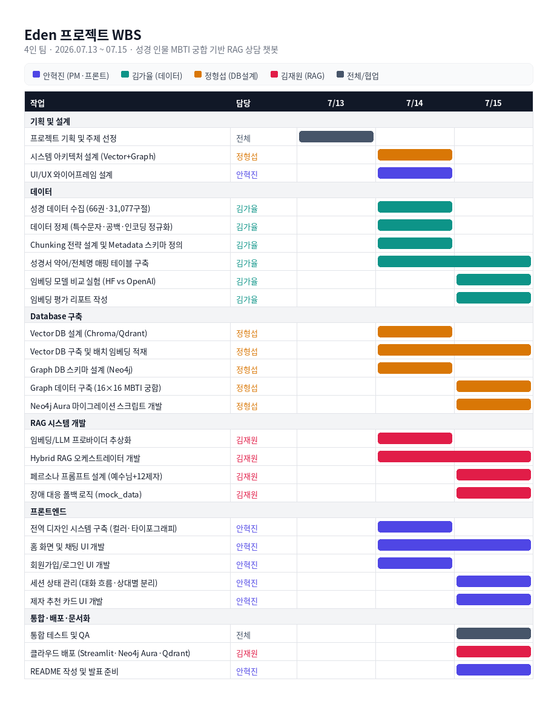
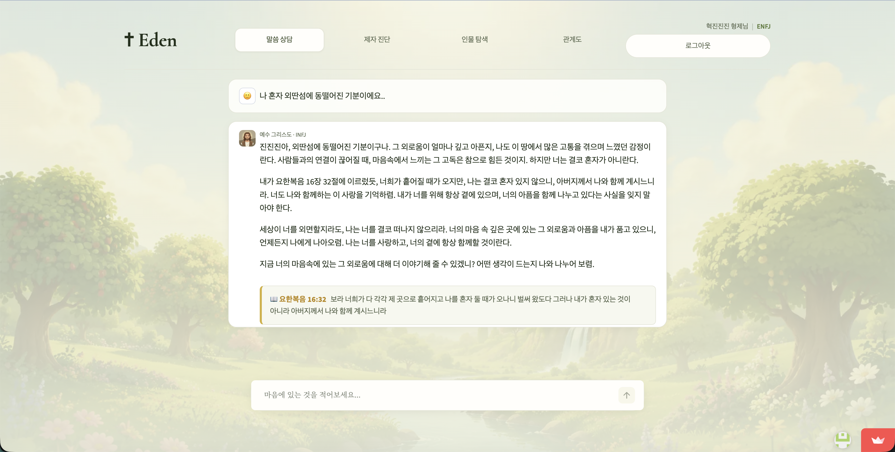
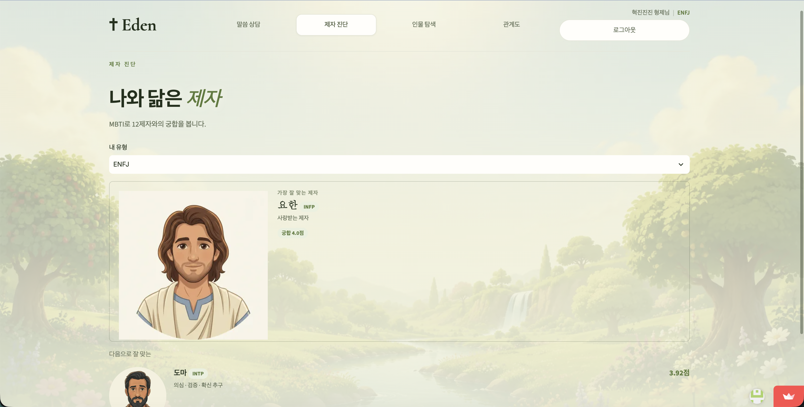
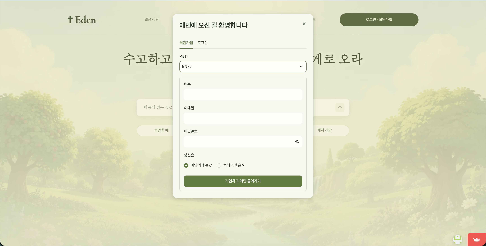
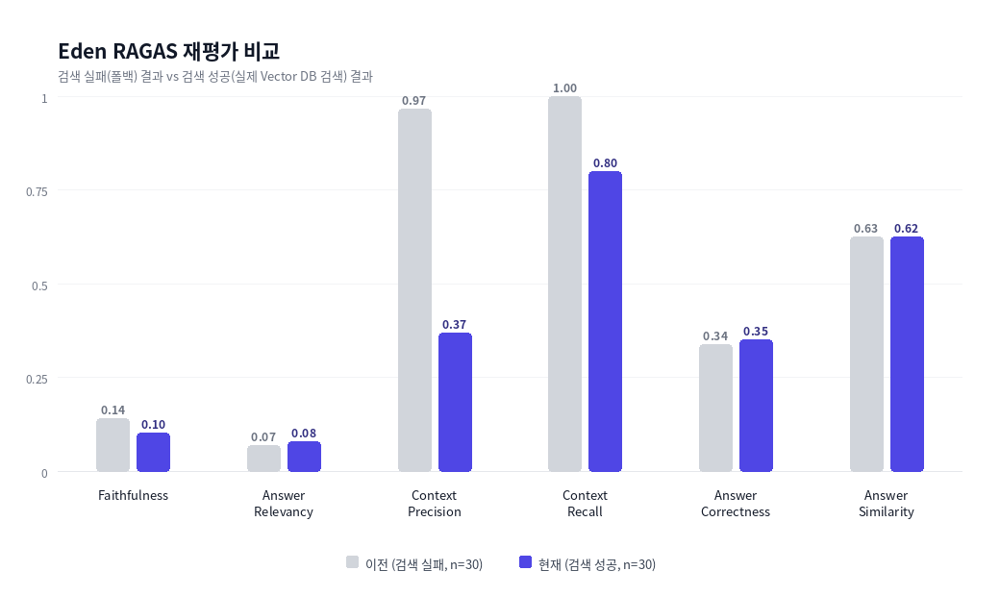

# <span style="color: brown;"> Eden</span>
<h2> 누구나 어렵지 않게 말씀으로 마음을 위로받을 수 있는 상담 챗봇 시스템</h2>


<h4><b style="color: brown;">Eden</b>은 사용자의 MBTI와 그날의 고민을 바탕으로 예수님·12제자 중 가장 잘 맞는 인물을 Neo4j 그래프로 찾아 매칭하고,<br>
그 인물의 페르소나로 성경 구절 기반 위로를 건네는 <b style="color: brown;">하이브리드 RAG(Vector + Graph) 상담 챗봇</b>입니다.<br>
 ChatOpenAI(LLM)와 임베딩 모델을 결합해 사용자의 자연어 고민에 의미론적으로 가장 가까운 성경 구절을 검색하고,<br>
 Neo4j에 저장된 curated MBTI 궁합 매트릭스로 "누가 답할지"를 함께 결정합니다.</h4>

```
Streamlit 단일 프로세스로 서비스 중이며(`streamlit_app.py`), 
배포는 Streamlit Community Cloud + Neo4j Aura + Qdrant Cloud 조합을 씁니다. 
```
**배포 상세는 [README_STREAMLIT.md](README_STREAMLIT.md) 참고.**


## ⭐️ 팀원 및 역할
<div align="center">
<table align="center">
  <tr>
    <td align="center" width="190px"></td>
    <td align="center" width="190px"></td>
    <td align="center" width="190px"></td>
    <td align="center" width="190px"></td>
  </tr>
  <tr>
    <td align="center"><b>안혁진(PM)</b></td>
    <td align="center"><b>김가율</b></td>
    <td align="center"><b>정형섭</b></td>
    <td align="center"><b>김재원</b></td>
  </tr>
    <tr>
    <td align="center">프론트엔드<br>설계, 기획</td>
    <td align="center">데이터 전처리, 정제<br>문서작성</td>
    <td align="center">Database 설계</td>
    <td align="center">RAG 시스템 구성</td>
  </tr>

  <tr>
    <td align="center"><a href="https://github.com/Jinxxxok"></a></td>
    <td align="center"><a href="https://github.com/Kim-gayul"></a></td>
    <td align="center"><a href="https://github.com/jhs7067"></a></td>
    <td align="center"><a href="https://github.com/kimjae9360"></a></td>
  </tr>
</table>
</div>

## 주제를 선택한 이유

종교의 선택은 개인의 자유이지만, 성경의 말씀은 특정 종교를 믿지 않는 사람에게도 위로가 될 수 있다고 생각했다.\
 최근 해외에서 "예수님과 대화할 수 있는 챗봇" 앱이 큰 인기를 얻고 있다는 점에서 착안해,\
  한국에서도 종교에 대한 거부감 없이 자연스럽게 성경 말씀에 다가가고 함께할 수 있는 상담 챗봇을 만들어보고자 이 주제를 선택했다.

### [기술적/비전적 이유 README](bible.md)

## WBS


## 📱기술 스택 

### Language


### Frontend


### Backend (레거시)


### AI / RAG


### Database


### Auth


### Deployment


### Package Manager


## 실행 방법
### 로컬
`
run_eden.bat
`
파일 실행을 하면 \
가상환경 생성 > requirements 설치 > 환경 변수 준비 > 데이터 파일 배치 확인 > streamlit 앱 실행이 진행됩니다.

### 배포 사이트
https://naaug3v4wb4dshd4skwf6q.streamlit.app/ **<< 링크 접속**
## 주요 기능

- **감정 기반 성경 구절 상담**: "마음이 슬플 때"처럼 감정이나 상황을 자연어로 말하면, 그래프 DB와 벡터 DB를 결합한 하이브리드 RAG가 의미상 가장 관련 있는 성경 구절을 찾아 답변한다.

- **MBTI 궁합 기반 인물 매칭**: 예수님과 몇 턴 대화를 나누면, Neo4j에 저장된 16×16 curated MBTI 궁합 데이터를 바탕으로 지금 대화에 가장 잘 맞는 제자를 추천한다.

- **대화 맥락 유지 및 분리**: 예수님과 제자, 그리고 제자들 간의 대화는 서로 다른 스레드로 완전히 분리해 기록되며, 제자에게 대화가 넘어갈 때는 예수님과 나눈 대화 요약을 함께 전달해 맥락이 끊기지 않는다.

- **12제자 개별 페르소나**: 각 제자는 성경 속 실제 일화와 성격을 반영한 고유한 말투와 조언 방식을 가지고 사용자를 대한다.

- **회원 인증 및 개인화**: 회원가입 시 입력한 성별에 따라 "형제님/자매님" 호칭을 자동으로 맞추고, 이름은 성을 뗀 자연스러운 형태로 부른다.

- **장애 대응 설계**: Neo4j·Vector DB·OpenAI 중 어느 하나가 끊기더라도 로컬 목업 데이터로 즉시 대체되어 서비스가 멈추지 않는다.

## 📂 프로젝트 구조 (Directory Structure)
```
3RD_PROJECT/
├── streamlit_app.py              # Streamlit 앱 진입점 — UI, 세션 상태, 대화 흐름 관리
├── eval_dashboard.py             # RAGAS 평가 결과를 확인하는 대시보드 스크립트
├── run_eden.bat                  # Windows 로컬 실행 자동화 (venv 생성 → 설치 → 실행)
├── requirements.txt              # 루트(Streamlit) 실행 의존성
├── bible.md                      # 주제 선정 배경 — 성경 기반 RAG의 장점 정리
├── README.md                     # 프로젝트 메인 문서
├── README_STREAMLIT.md           # Streamlit 배포/실행 가이드
│
├── .streamlit/
│   └── config.toml               # Streamlit 테마·서버 설정
│
├── backend/                      # 레거시 FastAPI 백엔드 (React/앱 전환 대비 보존)
│   ├── requirements.txt          # FastAPI 백엔드 의존성
│   ├── requirements-eval.txt     # RAGAS 평가 전용 의존성
│   ├── data/
│   │   └── users.json            # 회원 정보 (로컬 테스트용, git 제외 대상)
│   ├── scripts/
│   │   ├── build_vector_db.py    # Vector DB(Chroma) 구축 스크립트
│   │   ├── eval_embeddings.py    # 임베딩 모델 비교 평가
│   │   ├── eval_ragas.py         # RAGAS 평가 실행 스크립트
│   │   └── migrate_neo4j_to_aura.py  # Neo4j Aura 마이그레이션
│   └── app/
│       ├── main.py               # FastAPI 진입점 (현재 미사용, 레거시)
│       ├── api/                  # REST API 라우터 (레거시)
│       │   ├── auth_router.py
│       │   ├── chat_router.py
│       │   └── explore_router.py
│       ├── core/
│       │   └── config.py         # 환경설정 값 관리
│       ├── models/
│       │   └── schemas.py        # Pydantic 스키마
│       └── services/             # 핵심 로직 — Streamlit 앱이 직접 import
│           ├── hybrid_rag.py     # 그래프+벡터 하이브리드 RAG 오케스트레이터
│           ├── vector_store.py   # Chroma/Qdrant 벡터 검색
│           ├── graph_store.py    # Neo4j 그래프 연동 (MBTI 궁합)
│           ├── embeddings.py     # 임베딩 프로바이더 (OpenAI 등)
│           ├── llm.py            # LLM 프로바이더
│           ├── emotion.py        # 감정 분석
│           ├── prompts.py        # 예수님/12제자 페르소나 프롬프트
│           ├── auth.py           # 회원가입/로그인 로직
│           ├── mock_data.py      # 장애 대응 폴백 데이터
│           └── bible_books.py    # 성경 책 이름 정규화
│
├── data/
│   └── bible_structured.json     # 성경 원문 데이터 (66권 · 31,077구절)
│
├── docs/                         # 설계·평가 문서
│   ├── architecture_neo4j_vectordb.svg
│   ├── embedding_eval_report.md
│   └── ragas_eval_results.json
│
├── assets/                       # 인물 페르소나 이미지 (예수님 + 12제자, 앱 내 표시용)
│   ├── jesus.webp
│   ├── peter.webp / andrew.webp / james.webp / john.webp
│   ├── philip.webp / bartholomew.webp / thomas.webp / matthew.webp
│   ├── james_alph.webp / thaddaeus.webp / simon.webp / judas.webp
│   └── bg.webp                   # 배경 이미지
│
├── image/                        # README/발표 자료용 이미지 (전부 GitHub 업로드 필요)
│   ├── Eden RAG System Architecture.png     # RAG 아키텍처 다이어그램
│   ├── Eden Vector DB Architecture.png      # Vector DB 구조도
│   ├── Eden Graph DB Schema.png             # Graph DB 스키마도
│   ├── Eden Code Module Map.png             # 코드 모듈 맵
│   ├── Eden RAGAS Evaluation Pipeline.png   # RAGAS 평가 파이프라인 다이어그램
│   ├── Bible Data Pipeline Diagram.png      # 데이터 수집 파이프라인
│   ├── Bible Data Preprocessing Pipeline.png # 전처리 파이프라인
│   ├── eden_wbs.png                         # 팀 WBS(작업 분해) 차트
│   ├── ragas_scores_v2_chart.png            # RAGAS 재평가 결과 차트
│   ├── recall_mrr_comparison.png / recall_mrr_table.png  # 임베딩 평가 결과
│   ├── 대화장면.png / 궁합기반점수.png / 회원인증.png     # 앱 실행 화면 스크린샷
│   ├── Image_1~4.png                        # README/발표용 이미지
│   └── 십자가.svg / Heart.svg                # README용 아이콘
│
└── 산출물/                       # 발표·제출용 산출물 (챕터별 MD + 다이어그램 PNG)
    ├── 데이터수집.md / 데이터수집.png
    ├── 데이터전처리.md / 데이터전처리.png
    ├── VectorDB설계.md / VectorDB설계.png
    ├── GraphDB설계.md / GraphDB설계.png
    ├── RAG시스템아키텍처.md / RAG시스템아키텍처.png
    ├── 구현코드.md / 구현코드.png
    └── 라가스.png
```

> `.env`(API 키 등 실제 값 포함)와 `.git/`은 트리에서 제외했습니다 — `.gitignore`로 관리되거나 버전관리 자체 폴더라 GitHub에 노출되면 안 됩니다.

### 정리 내역

업로드해주신 압축 파일에서 실제 작동에 쓰이지 않는 아래 항목을 제거했습니다 (이미지 파일은 전부 보존).

| 항목 | 이유 |
|---|---|
| `.venv/` (약 790MB) | 로컬 가상환경 — `requirements.txt`로 언제든 재생성 가능, 이미 `.gitignore` 대상 |
| `__pycache__/` (3곳) | Python 컴파일 캐시 — 자동 재생성됨 |
| `.DS_Store` (6곳) | macOS 폴더 메타데이터 — 프로젝트와 무관 |
| `__MACOSX/` | 압축 시 생긴 macOS 전용 잔여 폴더 |
| `backend/data/chroma_db/chroma.sqlite3` | 실제 임베딩 0건인 빈 DB 파일 — 최초 실행 시 자동 재생성 |
| `backend/requirements 2.txt` | `requirements.txt`와 내용이 다른 중복 파일(맥 "Keep Both" 생성본으로 추정) — 실수 방지를 위해 제거 |

정리 후 압축 파일 용량은 **457MB → 24.5MB**로 줄었습니다.

### 참고— 확인이 필요한 부분

- `backend/data/users.json`에 실제 회원 이메일 2건(해시 처리된 비밀번호 포함)이 들어 있습니다. `.gitignore`에는 이미 등록돼 있지만, 압축 파일 형태로 공유할 때는 이 파일이 함께 나가지 않도록 한 번 더 확인하시는 걸 권장합니다.
- `.env`에도 실제 키 값이 들어 있을 가능성이 높습니다. 마찬가지로 공유 전 확인이 필요합니다.
## 수집한 데이터와 프로젝트의 관련성

성경 기반 챗봇 시스템은 개발자에게는 "RAG, 지식 그래프, 에이전트(LangGraph) 기술을 깊이 있게 다루고 최적화할 수 있는 최고의 아키텍처 연습 공간"이 되며, 사용자에게는 "필요한 순간에 가장 알맞은 영적 가이드와 위로를 건네주는 지능형 멘토"를 제공한다는 점에서 매우 가치 있고 흥미로운 프로젝트 주제입니다.
* **도메인 특화 지식 구축**: 본 프로젝트는 사용자의 자연어 질문이나 키워드에 맞춰 정확한 성경 구절을 매칭하고, \
이를 기반으로 답변을 생성하는 RAG(Retrieval-Augmented Generation) 시스템입니다.
* **의미론적 검색의 기반**: 성경은 비유적 표현, 고어(古語), 추상적인 개념이 많아 단순 키워드 매칭으로는 사용자의 의도(예: '마음이 슬플 때', '평안을 얻고 싶을 때')를 파악하기 어렵습니다.
 따라서 전체 성경 데이터를 수집하고 벡터화하여 의미론적 유사도 검색(Dense Retrieval)이 가능하도록 기본 컨텍스트를 제공하는 핵심 역할을 합니다.

## 수집 데이터
### - Vector DB
* **데이터명**: 성경 전서 (구약 성경 39권 및 신약 성경 27권, 총 66권)
* **데이터 규모**: 총 1,189장, 약 31,000개 이상의 구절(Verse) 데이터
* **데이터 구조**: 각 구절별로 서지 정보(책 이름, 장, 절)와 본문 내용이 매핑된 구조화된 형태의 텍스트 데이터(JSON형식 )
* **데이터 출처**: https://raw.githubusercontent.com/stranger828/bibleAPI/refs/heads/main/bible_structured.json

### - Graph DB

### 1. 성경 인물 성향·MBTI

- **활용 내용**: 성경 인물별 성향과 MBTI 구성에 활용
- **데이터 출처**: https://www.personality-database.com/profile?cid=18&pid=1&sub_cat_id=1792

### 2. MBTI 궁합

- **활용 내용**: MBTI 간 궁합 관계 구성에 활용
- **데이터 출처**: https://jobcannon.io/compatibility/mbti

### 3. 성경 인물 관련 구절

- **활용 내용**: 성경 인물별 관련 구절 정보 구성에 활용
- **데이터 출처**: https://www.biblegateway.com/learn/topics-themes/explainers/twelve-apostles/

## Application의 주요 기능

Eden은 크게 다섯 가지 핵심 기능으로 구성되어 있습니다.



첫째, **예수님과의 자유 대화 → 제자 추천**입니다. 사용자가 고민을 적으면 곧바로 제자를 추천하지 않고, 예수님과 몇 턴 자유롭게 대화합니다. LLM이 대화가 충분히 깊어졌다고 판단하면 그때 MBTI 궁합이 가장 잘 맞는 제자를 추천 카드로 보여주고, 수락 시 예수님과 나눈 대화 요약(`shared_memory`)을 그대로 들고 넘어가 맥락이 끊기지 않습니다.



둘째, **Neo4j curated MBTI 궁합 기반 추천**입니다. "누가 답할지"는 16×16 전체 조합의 실제 curated 궁합 점수(`MBTI_COMPATIBILITY`)와 사용자 MBTI-제자 직접 매칭(`MATCHES`)을 함께 반영해 결정하며, 단순 글자 유사도 근사가 아닙니다.

셋째, **자연어 기반 성경 구절 검색 및 상담**입니다. 사용자가 "마음이 슬플 때", "위로가 필요할 때"와 같이 일상어로 질문을 입력하면, 하이브리드 RAG 파이프라인(그래프가 고른 성경서 범위 + 벡터 유사도 검색)이 가장 관련성 높은 구절을 찾고, LLM이 답변에서 실제로 근거로 삼은 구절 1개만 표시합니다.

넷째, **대화 상대별 맥락 완전 분리**입니다. 예수님과의 대화, 그리고 이후 이어지는 제자와의 대화는 서로 다른 스레드로 완전히 분리되어 기록됩니다 — 다른 상대에게 한 말이 섞여 들어가 엉뚱한 답변으로 이어지는 문제를 원천 차단합니다.



다섯째, **회원 인증 및 개인화**입니다. bcrypt 해시 + 원자적 파일 쓰기로 실제 영속화되는 회원가입/로그인을 지원하며, 성별에 따라 예수님/제자가 "형제님"/"자매님" 호칭을 자동으로 맞추고 이름은 성을 뗀 형태로 자연스럽게 부릅니다.


<br>
<br>

# 📑 산출물

## 데이터 수집 / [README](산출물/데이터수집.md)


### 1. 데이터 개요

Eden이 사용하는 원천 데이터는 성경 전서(구약 39권 + 신약 27권, 총 66권)이며, 총 **31,077개 구절(Verse)**로 구성된다.\
 각 구절은 책 이름, 장 번호, 절 번호, 본문 내용이 하나의 레코드로 매핑된 구조화된 JSON 데이터다.

### 2. 데이터 출처

```
https://raw.githubusercontent.com/stranger828/bibleAPI/refs/heads/main/bible_structured.json
```

GitHub 공개 저장소(`stranger828/bibleAPI`)에서 배포하는 사전 구조화된 JSON 파일을 원본 데이터로 채택했다.

### 3. 데이터 구조

```json
[
  {
    "book": "창",
    "chapter": 1,
    "verse": 1,
    "content": "태초에 하나님이 천지를 창조하시니라"
  }
]
```

| 필드 | 타입 | 설명 |
|---|---|---|
| `book` | string | 성경 책 이름(약어 표기, 예: `창`, `계`) |
| `chapter` | int | 장 번호 |
| `verse` | int | 절 번호 |
| `content` | string | 절 본문 |

### 4. 데이터 배치 및 검증

원본 파일은 프로젝트 루트의 `data/bible_structured.json` 경로에 위치시킨다(`backend/app/core/config.py`의 `BIBLE_FILE` 설정 기준). 앱 최초 구동 시 `vector_store.ensure_vector_store()`가 벡터DB가 비어 있는지 확인하고, 비어 있으면 이 파일을 읽어 자동으로 임베딩을 시작한다. 파일이 존재하지 않으면 `build_vector_store()`가 `FileNotFoundError`를 발생시켜 누락을 즉시 알린다.

<br>
<br>


## 수집한 데이터 전처리 / [README](산출물/데이터전처리.md)
본 프로젝트에서 사용한 데이터는 책 이름, 장, 절과 본문 내용이 명확히 구분되어 있다. \
LLM 및 임베딩 모델이 오차 없이 인식할 수 있도록 다음과 같은 전처리 단계를 적용했다.


### 1. 문서 정제 방법
 
`backend/app/services/vector_store.py`의 `clean_text()` 함수가 본문 정제를 담당한다.
 
```python
def clean_text(text: str) -> str:
    if not text:
        return ""
    text = re.sub(r"\s+", " ", text.strip())
    text = re.sub(r"[^가-힣a-zA-Z0-9\s.,?!]", "", text)
    return text
```
 
- **구조적 정제**: 정규표현식(`re` 모듈)으로 불필요한 공백을 단일화하고, 한글·영문·숫자·기본 문장부호(`. , ? !`) 외의 문자를 제거한다. 원본 데이터가 이미 정제된 상태였기 때문에 적용 전후로 실질적인 변경은 발생하지 않았다.
- **예외 방어 처리**: `build_vector_store()`는 원본 파일이 존재하지 않으면 `FileNotFoundError`를 즉시 발생시켜, 이후 임베딩 단계에서 예기치 않은 오류가 나는 것을 사전에 차단한다.
- **텍스트 표준화**: `open(settings.BIBLE_FILE, "r", encoding="utf-8")`로 UTF-8 인코딩을 명시적으로 강제해, 로컬 Windows/Mac 환경 간 한글 깨짐 현상을 방지했다.
### 2. Chunking 방법 및 기준
 
일반적인 RAG 시스템은 문서를 임의의 글자 수 단위로 분할하지만,\
 성경 데이터의 특성을 고려해 **'1구절(Verse)' 단위를 하나의 독립적인 Chunk**로 간주했다. \
 성경은 하나의 절 자체가 완결된 의미 단위인 경우가 많아, 임의 글자 수로 자르면 장/절 경계가 무너져\
  "어떤 책 몇 장 몇 절"인지 출처를 밝혀야 하는 요구사항을 충족할 수 없기 때문이다.
 
검색 성능을 위해 `page_content`(임베딩 대상)와 `metadata`(출처 정보)를 다음과 같이 분리·가공해\
 LangChain `Document` 객체로 생성한다.
 
```python
page_content = f"[{item['book']} {item['chapter']}:{item['verse']}] {content}"
metadata = {
    "book": item["book"],
    "chapter": item["chapter"],
    "verse": item["verse"],
    "content": content,
}
```
 
- **page_content**: `"[책이름 장:절] 본문내용"` 형태로 조합해, 검색 시 출처 정보와 본문이 함께 임베딩 벡터에 반영되도록 처리
- **metadata**: 향후 UI상에서 유저에게 서지 정보를 깔끔하게 분리 서빙할 수 있도록 구조화
### 3. 배치 저장
 
수집된 31,077개 Chunk를 한 번에 DB에 주입하면 메모리 과부하(OOM)가 발생하므로, `build_vector_store(batch_size=500)`가 **500개 단위 배치**로 나누어 \
Vector DB(Chroma/Qdrant)에 순차적으로 임베딩·저장한다.

<br>
<br>

## Vector DB 설계 / [README](산출물/VectorDB설계.md)

Eden은 로컬 개발 환경과 배포 환경에서 서로 다른 Vector DB 백엔드를 사용한다. `backend/app/core/config.py`의 `VECTOR_BACKEND` 값 하나로 전환되며, 나머지 코드는 백엔드 종류를 신경 쓰지 않도록 추상화되어 있다.


| 환경 | 백엔드 | 컬렉션 | 비고 |
|---|---|---|---|
| 로컬 개발 | Chroma | `langchain`(`CHROMA_COLLECTION`) | `data/chroma_db`에 자동 영속화, 최초 실행 시 자동 재생성 |
| 운영 배포 | Qdrant Cloud | `bible_verses` | 사전에 OpenAI 임베딩으로 만들어 둔 31,077개 포인트 스냅샷을 복원해 사용, 재임베딩 없음 |

### 1. 백엔드 로딩

```python
def _load_chroma():
    from langchain_chroma import Chroma
    return Chroma(
        collection_name=settings.CHROMA_COLLECTION,
        persist_directory=settings.CHROMA_DB_DIR,
        embedding_function=get_embeddings(),
    )

def _load_qdrant():
    from langchain_qdrant import QdrantVectorStore
    from qdrant_client import QdrantClient
    client = QdrantClient(url=settings.QDRANT_URL, api_key=settings.QDRANT_API_KEY or None)
    return QdrantVectorStore(
        client=client,
        collection_name=settings.QDRANT_COLLECTION,
        embedding=get_embeddings(),
    )
```

### 2. Metadata 스키마

| 필드 | 타입 | 설명 |
|---|---|---|
| `page_content` | string | `"[책이름 장:절] 본문내용"` 형태로 조합된 임베딩 대상 텍스트 |
| `book` | string | 성경 책 약어(예: `창`, `벧전`) |
| `chapter` | int | 장 번호 |
| `verse` | int | 절 번호 |
| `content` | string | 구절 원문(출처 정보와 분리해 UI 서빙용으로 별도 보관) |

### 3. 검색 및 Graph-guided Filter

질의 임베딩과의 코사인 유사도 기반 Top-K 검색(`RETRIEVAL_K=5`)을 기본으로 한다. \
Neo4j가 고른 제자의 연관 성경서로 `book` metadata 필터를 적용해 검색 범위를 좁힌다(graph-guided filter).

```python
def _build_filter(books: list[str]):
    norm = normalize_books(books) or books
    backend = settings.VECTOR_BACKEND.lower()
    if backend == "qdrant":
        from qdrant_client import models
        return models.Filter(
            must=[models.FieldCondition(key="metadata.book", match=models.MatchAny(any=norm))]
        )
    return {"book": {"$in": norm}} if len(norm) > 1 else {"book": norm[0]}
```

필터에 넘기는 책 이름이 전체명/약어 어느 쪽이든 `bible_books.normalize_books()`가 실제 인덱스 표기(약어)로 맞춰준다. 필터 적용 결과가 0건이면 필터 없이 재검색해 구절이 통째로 사라지는 것을 방지한다.

<br>
<br>

## Graph DB 설계 / [README](산출물/GraphDB설계.md)

Eden은 "누가 답할지"(제자 궁합)와 "어떤 성경서 범위에서 찾을지"를 Neo4j 그래프로 결정한다. `backend/app/services/graph_store.py`가 조회 로직을, \
`backend/scripts/migrate_neo4j_to_aura.py`가 로컬→Neo4j Aura(운영) 마이그레이션을 담당한다.


### 1. Node 설계

| Node | 주요 Property |
|---|---|
| `Jesus` | `name, quote, quote_ref, traits, role, epithet, person_order, mbti` |
| `Disciple` | `id, name, title, speech_style, quote, quote_ref, traits, role, epithet, person_order` |
| `MBTI` | `type` |
| `Trait` | `name` |
| `Verse` | `ref, text` |
| `User` | `name, mbti, created_at` |

### 2. Relationship 설계

| 관계 | 방향 | 의미 |
|---|---|---|
| `FOLLOWS` | Disciple → Jesus | 제자가 예수님을 따름 |
| `HAS_MBTI {rank}` | Disciple → MBTI | 제자 자신과 어울리는 MBTI 1·2순위 |
| `MATCHES` | MBTI → Disciple | 사용자 MBTI → 직접 매칭되는 제자(16종 1:1) |
| `MBTI_COMPATIBILITY {score}` | MBTI → MBTI | 16×16 전체 궁합 curated 매트릭스(256쌍) |
| `HAS_TRAIT` | Disciple → Trait | 제자의 성향 키워드 |
| `RELATED_VERSE` | Disciple → Verse | 제자와 연관된 성경 구절 |
| `BROTHER_OF` | Disciple → Disciple | 형제 관계(예: 베드로–안드레, 야고보–요한) |
| `MATCHED_WITH {matched_at}` | User → Disciple | 회원이 실제로 매칭된 이력 |

### 3. Query 흐름

`recommend_disciples(user_mbti, limit)`는 3개 Cypher 쿼리를 순차 실행해 순위를 매긴다.

```python
_DIRECT_MATCH_CYPHER = """
MATCH (:MBTI {type: $user_mbti})-[:MATCHES]->(d:Disciple)
RETURN d.id AS id
"""

_MBTI_COMPAT_CYPHER = """
MATCH (:MBTI {type: $user_mbti})-[c:MBTI_COMPATIBILITY]->(m:MBTI)
RETURN m.type AS type, c.score AS score
"""
```

- `MATCHES` 관계로 직접 매칭되는 제자는 최고점(100점)을 부여한다.
- 나머지 제자는 자신의 `HAS_MBTI` 1·2순위 타입과 사용자 MBTI 간 `MBTI_COMPATIBILITY` curated 점수로 순위를 매긴다(1순위는 가중치 1.0, 2순위는 0.85).
- `get_person(person_id)`는 단일 제자의 프로필(quote, traits, 연관 구절 등)을 조회하며, `Jesus`는 `Disciple` 라벨이 아니므로 조회 결과가 없을 경우 상위 `hybrid_rag.py`가 `mock_data.py`로 폴백한다.

### 4. 폴백 설계

Neo4j 연결 실패 시 `mock_data.PEOPLE`(13개 인물 프로필)과 \
`mock_data.SCORES`(동일 구조의 16×16 궁합 매트릭스 로컬 사본)로 자동 대체되어 서비스가 중단되지 않는다.

### 5. 운영 전환

로컬 Neo4j(Desktop/Docker)의 데이터를 Neo4j Aura로 옮기기 위한 범용 export/import 스크립트(`migrate_neo4j_to_aura.py`)가 제공된다.
 노드와 관계를 그대로 읽어와 대상 DB를 비운 뒤 재생성하는 방식이며, \
 재실행해도 안전하다.

<br>
<br>

## RAG 시스템 아키텍처 / [README](산출물/RAG시스템아키텍처.md)

Eden의 RAG 파이프라인은 `backend/app/services/hybrid_rag.py`가 오케스트레이터 역할을 하며,\
 `recommend()`(추천)와 `answer()`(응답 생성) 2단계로 분리되어 있다. `streamlit_app.py`가 \
 HTTP 계층 없이 이 서비스 함수들을 직접 import해 호출하는 단일 프로세스 구조다.


### 1단계 — 추천 (`recommend`)

```python
def recommend(user_mbti: str, message: str, emo_weight: float = 1.0) -> dict:
    emotion = infer_emotion(message, use_llm_fallback=False)
    bias = EMOTION_BIAS.get(emotion, [])
    try:
        graph_rows = graph_store.recommend_disciples(user_mbti, limit=12)
        if not graph_rows:
            raise RuntimeError("empty graph result")
    except Exception:
        from app.services import mock_data
        graph_rows = mock_data.recommend_disciples(user_mbti, limit=12)
    ...
```

`emotion.infer_emotion()`으로 사용자 발화의 감정을 먼저 분류하고,\
 `EMOTION_BIAS` 딕셔너리로 감정별 어울리는 제자에 가산점을 준다. `graph_store.recommend_disciples()`가\
  Neo4j의 MBTI 궁합 점수(0~100)를 조회하며, 실패 시 `mock_data.recommend_disciples()`로 자동 폴백한다.

### ❗️대화 전환 판단 (`should_recommend`)

예수님과의 자유 대화가 제자를 추천할 만큼 충분히 깊어졌는지 판단하는 함수다.

```python
MIN_JESUS_TURNS = 2   # 이보다 적으면 아직 추천하지 않음
MAX_JESUS_TURNS = 6   # 이보다 많으면 LLM 판단 없이 강제 추천
```

사용자 턴 수가 최소치 미만이면 추천하지 않고, 최대치 이상이면 무조건 추천한다.\
 그 사이 구간에서만 LLM에게 "지금 추천해도 되는지"를 '예/아니오'로 판단하게 하며,\
  LLM 호출 실패 시 턴 수 휴리스틱(3턴 이상)으로 폴백한다.

### 2단계 — 응답 생성 (`answer`)

```python
def retrieve_verses(message: str, books: list[str] | None) -> list[dict]:
    query = _hyde_expand(message) if settings.USE_HYDE else message
    fetch_k = settings.RETRIEVAL_FETCH_K if settings.USE_RERANK else settings.RETRIEVAL_K
    docs = vector_store.search(query, k=fetch_k, books=books)
    if settings.USE_RERANK:
        docs = _rerank(message, docs, settings.RETRIEVAL_K)
    return docs
```

- **(선택) HyDE**: `config.USE_HYDE`(기본 `False`)가 켜지면 질문을 가상의 성경적 답변으로 확장해 검색어로 사용한다.
- **Vector 검색**: `vector_store.search()`가 추천된 제자의 연관 성경서로 필터링된(graph-guided) 유사도 검색을 수행한다.
- **(선택) Rerank**: `config.USE_RERANK`(기본 `False`)가 켜지면 `sentence_transformers.CrossEncoder`로 1차 결과를 재정렬한다.

이후 `_persona_prompt()`가 인물 프로필·검색된 구절·대화 이력·`shared_memory`(예수님과 나눈 대화 요약)를 `prompts.build_prompt()`에 전달해 최종 프롬프트를 조립하고, `llm.get_llm().invoke()`로 답변을 생성한다.

### 핵심 구절 1개 추출

```python
_KEY_RE = re.compile(r"\[\s*핵심\s*구절\s*[:：]\s*([^\]]*)\]")

def _split_key_verse(text: str, verses: list[dict]) -> tuple[str, list[dict]]:
    ...
```

LLM 응답 끝의 `[핵심구절: 마태복음 11:28]` 표시를 읽어,\
 검색된 여러 구절 중 이번 답변에서 실제로 근거로 삼은 구절 1개만 골라 화면에 표시한다.\
  LLM이 표시를 빠뜨리면 검색 1순위 구절로 폴백하고, `[핵심구절: 없음]`이면 구절을 붙이지 않는다.

### 폴백 설계

`answer()`는 각 단계를 독립적으로 try/except로 감싸 다음과 같이 폴백한다.

| 단계 | 실패 시 폴백 |
|---|---|
| 인물 프로필 조회(`graph_store.get_person`) | `mock_data.PEOPLE` |
| 구절 검색(`retrieve_verses`) | `settings.ALLOW_MOCK_VERSES`(기본 `False`)가 켜져 있으면 `mock_data.mock_verses()`, 꺼져 있으면 구절 없이 진행 |
| LLM 응답 생성 | `mock_data.mock_persona_answer()` |

이 구조 덕분에 Neo4j·Vector DB·OpenAI API 중 무엇이 끊겨도 서비스가 끝까지 응답을 반환한다.

<br>
<br>

## 수집한 데이터 셋 / 전처리한 데이터 셋
### 수집한 데이터 셋
- [bible_structured.json](data/bible_structured.json) \ 성경전서
- **github** https://raw.githubusercontent.com/stranger828/bibleAPI/refs/heads/main/bible_structured.json

### 전처리한 데이터 셋

- Vector DB(Chroma/Qdrant cloud) / Graph DB(Neo4j Aura) 적재\
**참조**: [데이터 셋 전처리 과정](#수집한-데이터-전처리--readme)


<br>
<br>

## 구현 코드 / [README](산출물/구현코드.md)

`streamlit_app.py`가 진입점이며,\
 `backend/app/services/` 아래 서비스 모듈을 HTTP 계층 없이 직접 import해 호출한다.\
  `backend/app/api/`, `backend/app/main.py`, `backend/app/models/schemas.py`는 \
  초기 FastAPI+React 설계의 잔재로 저장소에 남아 있으나 현재 Streamlit 실행 경로에서는 사용되지 않는다.


### 1. 진입점

| 파일 | 역할 |
|---|---|
| `streamlit_app.py` | UI 전체 렌더링 + `backend/app/services` 직접 import(HTTP 없음). 최초 구동 시 `_ensure_vector_store_ready()`로 벡터DB 콜드스타트를 처리 |
| `backend/app/main.py` | FastAPI 진입점(레거시, Streamlit 경로 미사용) |

### 2. Backend 서비스 모듈

| 파일 | 역할 | 주요 함수 |
|---|---|---|
| `core/config.py` | 모델·DB·경로 등 전역 설정을 pydantic-settings로 단일화 | `Settings`, `get_settings()` |
| `services/embeddings.py` | 임베딩 모델 프로바이더(huggingface/openai/ollama) 추상화 | `get_embeddings()` |
| `services/llm.py` | LLM 프로바이더(openai/ollama/anthropic) 추상화 | `get_llm(temperature)` |
| `services/vector_store.py` | 성경 구절 Vector DB(Chroma/Qdrant) 적재·검색 | `build_vector_store()`, `search()`, `ensure_vector_store()` |
| `services/graph_store.py` | Neo4j 조회(제자 추천, MBTI 궁합, 인물 프로필) | `recommend_disciples()`, `get_person()`, `best_matching_mbti()` |
| `services/bible_books.py` | 성경 66권 전체명 ↔ 약어 매핑(필터 안전망) | `to_abbr()`, `to_full()`, `normalize_books()` |
| `services/emotion.py` | 사용자 발화 감정 추론(키워드 우선, LLM 폴백 선택) | `infer_emotion()` |
| `services/hybrid_rag.py` | 하이브리드 RAG 오케스트레이터(추천/응답 생성 제어) | `recommend()`, `should_recommend()`, `retrieve_verses()`, `answer()` |
| `services/prompts.py` | 예수님/12제자 페르소나 시스템 프롬프트 조립 | `build_prompt()`, `build_graph_context()`, `given_name()` |
| `services/auth.py` | 회원가입·로그인·JWT 발급(JSON 파일 영속화) | `signup()`, `login()`, `issue_token()`, `verify_token()` |
| `services/mock_data.py` | DB/LLM 미연결 시 폴백 데이터 및 목업 로직 | `PEOPLE`, `SCORES`, `recommend_disciples()`, `mock_verses()`, `mock_persona_answer()` |

### ❗️레거시 FastAPI 코드(미사용)

| 파일 | 역할 |
|---|---|
| `api/auth_router.py` | `/api/auth/signup`, `/login`, `/me` |
| `api/chat_router.py` | `/api/chat/recommend`, `/answer` |
| `api/explore_router.py` | `/api/explore/people`, `/person/{id}`, `/match/{mbti}`, `/graph` |
| `models/schemas.py` | 요청/응답 Pydantic 스키마(프론트-백엔드 계약) |

### 3. 운영 스크립트

| 파일 | 역할 |
|---|---|
| `scripts/build_vector_db.py` | 프로젝트 루트 기준 절대경로로 로컬 Chroma DB를 재생성하는 CLI |
| `scripts/eval_embeddings.py` | HuggingFace `ko-sroberta-multitask` vs OpenAI `text-embedding-3-small` 검색 정확도(Recall@k, MRR) 비교 |
| `scripts/migrate_neo4j_to_aura.py` | 로컬 Neo4j 데이터를 Neo4j Aura로 export/import |

<br>
<br>

## 💯 RAGAS 평가


## RAGAS 평가 결과

Eden의 하이브리드 RAG 파이프라인을 [RAGAS](https://github.com/explodinggradients/ragas)로 평가했습니다. \
(n=30, seed=42, judge LLM: `gpt-4o-mini`)



| 지표 | 점수 | 설명 |
|---|---:|---|
| Context Recall | 0.80 | 필요한 정보의 80%를 검색으로 확보 |
| Context Precision | 0.37 | 검색된 구절 중 실제 관련도가 높은 비율 |
| Answer Correctness | 0.35 | 정답 대비 응답의 정확도 |
| Answer Similarity | 0.63 | 정답과의 의미적 유사도 |
| Faithfulness | 0.10 | 응답 내용이 검색 문맥에 근거하는 정도 |
| Answer Relevancy | 0.08 | 응답이 질문에 직접 대응하는 정도 |

인용된 성경 구절 자체는 샘플 검증(5건 중 4건)에서 실제 검색 문맥과 정확히 일치했습니다. 다만 Faithfulness·Answer Relevancy는 예수님/제자 페르소나 특유의 공감·위로 표현이 답변 대부분을 차지하면서 상대적으로 낮게 측정되었으며, 이는 페르소나 기반 상담 챗봇에서 QA형 지표가 가지는 구조적 한계와 실제 개선 여지가 함께 반영된 결과로 보고 있습니다.

## 개선 방향

- 답변에서 구절 인용 부분과 페르소나 해설 부분의 비중을 조정해 Faithfulness 개선
- Retrieval top-k 축소 또는 재랭킹 도입으로 Context Precision 개선
- 사람이 검수한 참조 답변(ground truth) 세트 구축으로 Answer Correctness/Similarity 신뢰도 향상
- 인용-문맥 일치 여부를 자동 검증하는 보조 스크립트 추가
- 페르소나 특성을 반영한 보완 평가 지표(인용부 전용 Faithfulness 등) 설계 검토

<br>
<br>

# 회고

## 문제와 해결 방법
### 1) RAGAS 평가 중 asyncio 타임아웃 오류
 
**문제**
평가 시작 직후 `RuntimeError: Timeout should be used inside a task` 발생, 모든 지표 NaN 처리.
 
**원인**
Python 3.11+ `asyncio.timeout` ↔ RAGAS 0.2.x가 강제 실행하는 `nest_asyncio.apply()`의 호환성 충돌.
 
**해결**
RAGAS import 직전 `nest_asyncio`를 빈 더미 모듈로 몽키패치 → `apply()` 무력화, 순정 asyncio 환경 유지.
 
**배운 점**
오타 → 버전 호환성 → 라이브러리 내부 구조 → asyncio 컨텍스트까지, 문제를 단계적으로 파고들어 해결한 경험.
 
### 2) React → Streamlit 전환
 
초기에는 React로 프론트엔드를 구성했지만, 프론트/백엔드 서버를 각각 띄워야 하는 구조라 관리 부담이 컸고, React를 처음 다뤄보면서 디버깅·유지보수에 예상보다 훨씬 많은 시간이 들었습니다. 결국 발표 전날 Streamlit 단일 서버 구조로 급히 전환해 완성도를 확보했습니다. 추후 다시 React 체제로 전환할 계획이며, 같은 문제가 반복되지 않도록 React 문법과 디버깅·유지보수 역량을 미리 학습하고 있습니다.
## 팀원 개인 회고

### 안혁진
```
두번째로 맡아보는 PM 자리였지만 이번엔 팀원들 다들 프로젝트에 경험이 몇번 있다보니 뭔가를 맡기지 않아도 알아서 척척해주는 모습을 보고 너무 감사했다. 업무를 분담하고 마무리와 프론트엔드를 담당하게 되어서 React로 작업을 진행해보려고 했지만 아직 어색한 리액트 사용에 디버깅 및 유지보수가 너무 힘들다고 판단되었고 팀원들도 좀 더 로컬에서 간단히 돌릴 수 있는 Streamlit으로 돌리자는 의견을 모아서 얼마 남지않은 시간에 프론트엔드 툴자체를 변경하며 팀원들이 많은 고생을 해서 팀장으로써 너무 고마운 마음뿐이였다 다들 맡은 자리에 맡은 업무 잘해줘서 고맙고 PM으로써 한층 더 성장할 수 있었던 프로젝트가 된 것 같아서 너무 만족스럽다. 4차 프로젝트에선 한층 더 성장한 결과물로 돌아오겠습니다 감사합니다 3팀!
```
### 김가율
```
수업내용을 실습으로 적용해보기에 난이도가 있는 편이었고 
제대로 작동하는 챗봇시스템을 만드는게 쉽지 않다는 것을 느꼈습니다.
```
### 김재원
```
수업중 예시를 통해 학습했던 벡터 DB 구성에서 허깅페이스와 오픈ai를 둘 다 진행해보고 
비교해볼 수 있어서 어떤 상황에서 진행하면 좋을지를 알게 돼서 좋은 시간이었습니다.
하지만 연동하는 과정에서 이해가 안 되는 부분이 많았지만 직접 부딪히면서 과정을 알아가며 
자연스러운 학습을 할 수 있게 되었고 4차 프로젝트 때에는 더 나은 결과물을 만들기 위해 
팀원들과 더욱더 적극적인 소통을 진행하고 싶습니다.
```
### 정형섭
```
도메인에 대한 배경지식이 부족했고, DB 설계 방향을 잡는 데에도 어려움이 있었습니다. 
진행 과정에서 어려운 부분을 팀원들에게 공유하고 도움을 받으며 문제를 풀어갔지만, 
더 많이 기여하지 못한 아쉬움과 함께 도메인 이해와 사전 설계의 중요성을 느꼈습니다.
```